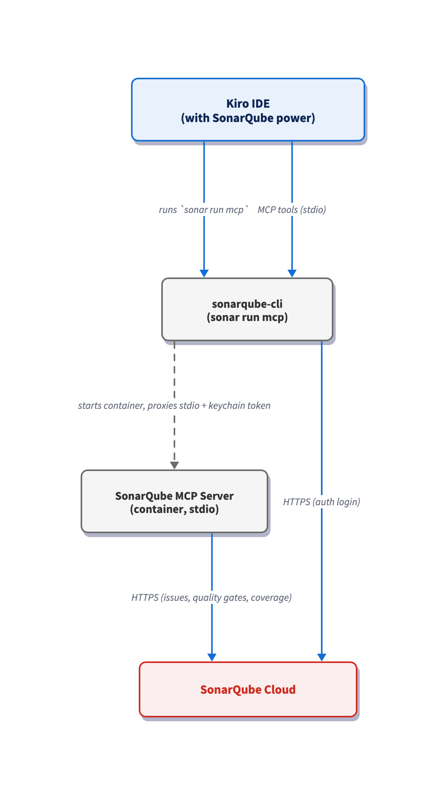

# Set up the SonarQube power for Kiro

> Last verified: July 2026

## TL;DR overview

- The SonarQube power for Kiro adds SonarQube code quality and security analysis to the Kiro IDE agent loop, catching bugs, vulnerabilities, and leaked secrets in AI-generated code.  
- Reach for it when the Kiro agent writes or edits code you intend to commit and you want issues flagged before review rather than after.  
- Running SonarQube analysis inside the agent loop means hardcoded credentials, unclosed resources, and code smells get caught at generation time instead of in a later pull request or in production.  
- Installation adds the SonarQube MCP server to Kiro, authentication runs once through the SonarQube CLI with tokens stored in the system keychain, and the agent can then analyze new code on demand against 7,500+ issue types across 30+ languages.

This blueprint configures the [SonarQube power](https://github.com/SonarSource/sonarqube-agent-plugins/blob/master/kiro-power/POWER.md) for [Kiro](https://kiro.dev/) so that issue scanning, quality gate checks, security analysis, and secrets detection are accessible from inside the same Kiro IDE sessions that write your code. Installing the power registers the [SonarQube MCP Server](https://www.sonarsource.com/products/sonarqube/mcp-server/) in Kiro and hands the agent SonarQube's rule set on demand. Under the hood, the [SonarQube CLI](https://cli.sonarqube.com/) is the runtime the power depends on; it launches the MCP server and handles authentication. Our step-by-step walkthrough follows the Python-based [AWS CLI](https://github.com/aws/aws-cli), but the steps apply to any project written in any [SonarQube-supported language](https://www.sonarsource.com/knowledge/languages/).

## When to use this

- You drive [Kiro](https://kiro.dev/) as your primary [AI coding agent](https://www.sonarsource.com/resources/library/what-is-an-ai-agent/) and want SonarQube capabilities available without leaving the agent session.  
- You want issue surfacing, security analysis, and rule-driven fixes inside the same session that writes your code, not waiting on the next CI run or a PR-time review.

## What you'll achieve

- SonarQube power installed in Kiro, with the SonarQube MCP Server registered in `~/.kiro/settings/mcp.json` and its tools available to the agent.  
- An authenticated SonarQube CLI connection, with your user token stored in the system keychain and your projects visible to the agent.  
- A working analyze-before-commit loop where Kiro writes code, runs it through SonarQube's rules, surfaces findings, and applies fixes inline before you commit.

## Architecture



Kiro communicates with the MCP server over stdio, but not directly. When the agent needs analysis, Kiro runs `sonar run mcp`, which starts the [SonarQube CLI](https://cli.sonarqube.com/). The CLI's role is deliberately narrow: it detects your container runtime (Docker, Podman, or Nerdctl), starts the SonarQube MCP Server in a container with your keychain-stored token, and proxies stdio between Kiro and that container. Every MCP tool call flows through the CLI. The MCP Server itself, not the CLI, downloads and syncs the analyzer plugins, so snippet analysis runs locally inside the container; anything that needs your project's history, such as open issues, measures, or quality gate status, is fetched from your connected SonarQube Server or SonarQube Cloud instance.

## Prerequisites

- [**Kiro IDE**](https://kiro.dev/ide/) installed and authenticated  
- [**SonarQube Cloud**](https://www.sonarsource.com/products/sonarqube/cloud/) **account** or [**SonarQube Server**](https://www.sonarsource.com/products/sonarqube/server/) with the demo project on board  
- [**SonarQube CLI**](https://cli.sonarqube.com/) installed and (preferably) authenticated  
- **Docker, Podman, or Nerdctl** running; the SonarQube MCP Server runs as a container managed by the SonarQube CLI  
- **(Optional, but preferred)** a `sonar-project.properties` file pointing to your project

**Demo project:** Fork [`aws/aws-cli`](https://github.com/aws/aws-cli) to your GitHub account, import it into SonarQube Cloud with CI-based analysis enabled, and clone it locally.

### Step 1 — Install the SonarQube power

Open the Kiro Powers marketplace, search for **SonarQube**, and click **Add to Kiro**. 

Select **Open in Kiro** and click **Install** on the opened power page.

Kiro registers the MCP server for you. There's no config file to hand-edit and no token to paste. If you open your MCP configuration at `~/.kiro/settings/mcp.json`, you'll see the power entry Kiro added:

As you work through setup, Kiro pauses to ask permission before running tools. Choose **Allow** to approve a single action, or **Always allow** to stop being prompted for that tool.

### Step 2 — Configure the SonarQube power

Navigate back to the power and click **Try power**. Kiro activates the power, reads its bundled documentation, and gives you a short overview of what it can do: analyze code, search and manage issues, check quality gates, and track coverage and metrics.

Next, the agent checks whether the SonarQube CLI is installed by running:

```shell
which sonar
```

If the CLI is present and you've already authenticated, the agent confirms you're connected and lists your SonarQube Cloud projects. You're done with this step.

If you haven't authenticated yet, run the login command that matches your setup. The browser opens to complete the flow, and your token is stored securely in your system keychain, so there's no manual token management afterward.

For SonarQube Cloud, find your organization key at [sonarcloud.io/account/organizations](https://sonarcloud.io/account/organizations). Confirm the connection at any time with:

```shell
sonar auth status
```

Once you're authenticated, the agent reports the lay of the land: where the SonarQube CLI is installed, that you're connected, and the projects available in your organization.

### Step 3 — Analyze generated code before committing it

Ask Kiro to generate code, and let it run that code through SonarQube before calling the work done. For a concrete example, provide the agent this prompt:

```
Add s3_helper.py at the project root with an upload_with_retry(bucket, key, file_path, max_retries=3) function. Retry on transient errors, log each attempt, and raise a clear error if all retries fail. Include a TODO for adding metric emission later.
```

Kiro checks the project's conventions first, then writes the file. Before declaring it finished, the agent scans the new code for secrets and runs it through SonarQube's rules with full file context. That last part matters: the agent analyzes the complete file but reports only the issues in the code it just generated, so you see signal instead of noise.

In our demo run, here's the issues summary it returns:

- **Critical / Security (×3):** hardcoded credentials (×2) and an unclosed file handle.  
- **Major (×3):** an unused import, an unused flag, and a no-op `None` check.  
- **Minor (×4):** an unused exception variable, string concatenation, a duplicate log call, and a redundant `continue`.  
- **Info (×1):** the unresolved TODO.

The hardcoded credentials are exactly the kind of defect that's cheap to fix at generation time and expensive to fix after the code ships. Ask the agent to remediate the issues, then have it re-analyze to confirm they're resolved.

## Verify the setup

Confirm three things and you're fully set up:

1. The `sonarqube` power shows as installed in Kiro, and the `powers` entry exists in `~/.kiro/settings/mcp.json`.  
2. `which sonar` resolves to the CLI path, and the agent reports you're authenticated with your project list (or `sonar auth status` reports an active connection).  
3. Prompting the agent to list your SonarQube projects returns the full project list from SonarQube Cloud.

## What to know

- Use a SonarQube **user** token. Project, global, and scoped organization tokens fail during setup. The CLI stores the token in your system keychain, so there's nothing to paste into a config file.  
- Let the agent analyze with full file content plus a snippet filter. It analyzes the whole file for accuracy but reports only the issues in the newly generated code.  
- Keep the agent's context lean with selective toolsets (`sonar run mcp --toolsets analysis,issues,quality-gates`) or run `sonar run mcp --read-only` for safer, read-only exploration.  
- Common snags: `Project not found` usually means the wrong organization or an unresolved project key; `Connection refused` points at a bad server URL or a self-signed certificate; `sonar: command not found` right after install means you need to restart your terminal so it reloads PATH; and a region mismatch happens when an EU token is used against the US instance.

## Next steps

- Set up the SonarQube plugin for [Claude Code](https://www.sonarsource.com/resources/library/set-up-the-sonarqube-plugin-for-claude-code/), [Codex CLI](https://www.sonarsource.com/resources/library/set-up-the-sonarqube-plugin-for-codex/), [GitHub Copilot CLI](https://www.sonarsource.com/resources/library/set-up-the-sonarqube-plugin-for-github-copilot-cli/), [Cursor](https://www.sonarsource.com/resources/library/set-up-the-sonarqube-plugin-for-cursor/), and [more](https://github.com/SonarSource/sonarqube-agent-plugins)  
- Familiarize yourself with [SonarQube CLI](https://cli.sonarqube.com/) [commands](https://docs.sonarsource.com/sonarqube-cli/using-sonarqube-cli/commands)  
- Dive deeper into the [SonarQube MCP Server docs](https://docs.sonarsource.com/sonarqube-mcp-server/about-the-mcp-server)  
- Read how [Sonar Vortex](https://www.sonarsource.com/blog/introducing-sonar-vortex/) guides and verifies agent-generated code across the Guide and Verify stages  
- Connect the Guide, Verify, and Solve dots with Sonar's [Agent Centric Development Cycle](https://www.sonarsource.com/agent-centric-development/) framing
